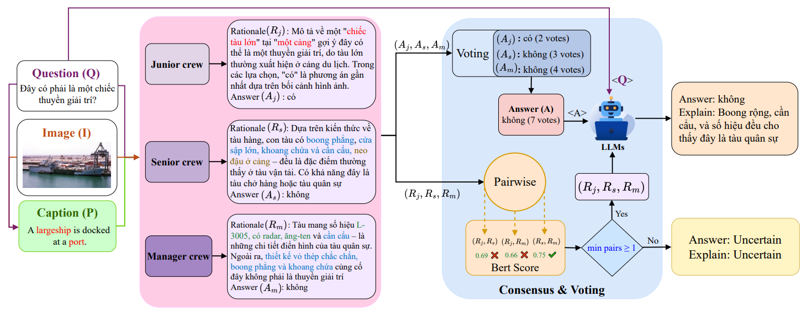

# A knowledge-based multi-agent approach for Vietnamese VQA with rationale explanations

<!-- Badges: Add badges here, e.g., License, Python version, etc. -->
[](https://choosealicense.com/licenses/mit/)

This project introduces a multi-agent system for Vietnamese Visual Question Answering (VQA). It leverages external knowledge sources to provide answers with detailed, rationale-based explanations.

---

## 📖 Introduction

Traditional Visual Question Answering (VQA) models often operate as "black boxes," providing answers without explaining their reasoning. This limitation reduces trust and utility, especially in complex scenarios that require external knowledge. This project addresses the challenge by implementing a knowledge-based multi-agent system designed to provide not just answers, but also the reasoning behind them, specifically for Vietnamese VQA.

Our approach mimics a human analytical workflow using three distinct agents orchestrated by LangGraph:
- **Junior Analyst**: Performs the initial visual analysis using a foundational VQA model to generate a basic description and answer.
- **Senior Analyst**: Enriches the initial findings by querying external knowledge bases (e.g., Wikipedia, ArXiv, DuckDuckGo) to gather relevant context and verify information.
- **Manager Analyst**: Synthesizes all gathered information—visual descriptions, initial answers, and external knowledge—to produce a final, comprehensive answer complete with a step-by-step rationale.

This hierarchical process ensures that the final output is robust, verifiable, and explainable, bridging the gap between simple VQA and true visual understanding.

## 🏗 Framework

The overall architecture of the multi-agent system is shown below:

 

## 🚀 Quick Start

This section provides a complete, step-by-step guide to setting up a clean environment and running the project.

### 1. Prerequisites
- **Conda**: To manage dependencies in an isolated environment.
- **Python 3.10+**
- **API Keys**: For any external services you wish to use (e.g., OpenAI).

### 2. Installation

```bash
# Clone the repository and navigate into the directory
git clone --recurse-submodules https://github.com/T-Sunm/Visual-Multi-Agent-Knowledge-QA-.git
cd Visual-Multi-Agent-Knowledge-QA-
```

**Step A: for main gpraph**
```bash
# Create a new conda environment named 'vivqa-minh' with Python 3.10
conda create -n vivqa-minh python=3.10 -y
conda activate vivqa-minh
pip install -r requirements
```
**Step B: for vqa-tool**
```bash
cd ViVQA-X
conda create -n mak_vivqax_lstm
pip install -r requirements
pip install fastapi==0.115.12 uvicorn[standard]==0.34.2 python-multipart
```
### 3. Usage

The system can be run with a local or remote LLM.

#### Step 3a: Run the LLM Server (for Local Models)
If you are using a local model with VLLM, open a new terminal, activate the `vivqa-minh` conda environment, and start the server. The following is an example command for the Qwen model.

```bash
# Command to serve a local LLM with VLLM
CUDA_VISIBLE_DEVICES=1 \
vllm serve Qwen/Qwen3-1.7B \
  --port 1234 \
  --dtype auto \
  --gpu-memory-utilization 0.45 \
  --max-model-len 4096 \
  --enable-auto-tool-choice \
  --tool-call-parser hermes \
  --trust-remote-code
```

starte tool 1: use conda name: mak_vivqax_lstm
```bash
cd api
python main.py
```

#### Step 3b: Run Sampls Query
Once the environment is set up (and the local LLM server is running, if applicable), you can run a query from the command line.
Go to scripts/full_system.sh, change --samples is num sample you want to test. if set = 0 is run full sample, else is num_sample you want run 
```bash
bash scripts/full_system.sh
```

## 📁 Repository Structure

The project is organized as follows:

```
.
├── src/
│   ├── agents/          # Contains the logic for each agent (Junior, Senior, Manager).
│   ├── core/            # Implements the core multi-agent graph using LangGraph.
│   ├── models/          # Defines Pydantic models for state management.
│   ├── tools/           # Houses tools for VQA and external knowledge retrieval.
│   ├── utils/           # Includes utility functions and helper scripts.
│   ├── evaluation/      # Scripts for evaluating model and agent performance.
│   └── main.py          # Entry point for running the application.
│
├── ViVQA/               # Submodule containing the underlying Vietnamese VQA model implementation.
│
├── notebooks/           # Jupyter notebooks for experimentation and analysis.
│
├── .env.example         # Example environment file.
└── requirements.txt     # Project dependencies and detailed installation guide.
```

## 📊 Dataset

This system is designed to work with Vietnamese VQA datasets. The integrated **ViVQA-X**, which uses images from the MS COCO dataset.

### Data Aquisition

### Expected Structure
The scripts expect the data to be organized in a specific structure. The code often references a root directory like `/mnt/VLAI_data/`. A typical structure would be:
```
/path/to/your/data/
├── COCO_Images/
│   ├── train2014/
│   └── val2014/
│
└── ViVQA-X/
    ├── ViVQA-X_train.json
    └── ViVQA-X_val.json
```

## 📊 Results

Performance comparison on the **ViVQA-X test set**.  
Metrics include: BLEU (B1–B4), METEOR (M), ROUGE-L (R-L), CIDEr (C), SPICE (S), BERTScore-MaxRef (BS-MR), and Answer Accuracy (Acc).  

| Method              | B1    | B2    | B3    | B4    | M     | R-L   | C     | S    | BS-MR | Acc   |
|---------------------|-------|-------|-------|-------|-------|-------|-------|------|-------|-------|
| Heuristic Baseline  | 8.46  | 3.0   | 1.3   | 0.6   | 8.5   | 7.9   | 0.5   | 0.6  | 70.8  | 10.1  |
| LSTM-Generative     | 22.6  | 11.7  | 6.2   | 3.2   | 16.4  | 23.7  | 34.1  | 4.3  | 72.2  | 53.8  |
| **NLX-GPT**         | **42.4** | **27.8** | **18.5** | **12.4** | 20.4  | **32.8** | **51.4** | **5.0** | **76.3** | 53.7  |
| OFA-X               | 30.1  | 22.5  | 10.9  | 9.2   | 17.6  | 25.4  | 25.7  | 3.9  | 68.9  | 50.5  |
| ReRe                | 34.0  | 21.2  | 13.8  | 9.0   | **20.8** | 29.4  | 35.5  | 4.2  | 74.9  | 47.5  |
| **VMARC-QA (ours)** | 27.5  | 14.8  | 8.1   | 4.4   | 17.6  | 22.4  | 23.6  | 4.0  | 76.0  | **64.8** |

## 📜 Citation

If this project is based on a research paper, add the BibTeX citation information here.

## 📝 License

This project is licensed under the MIT License. See the [LICENSE](LICENSE) file for details. 
