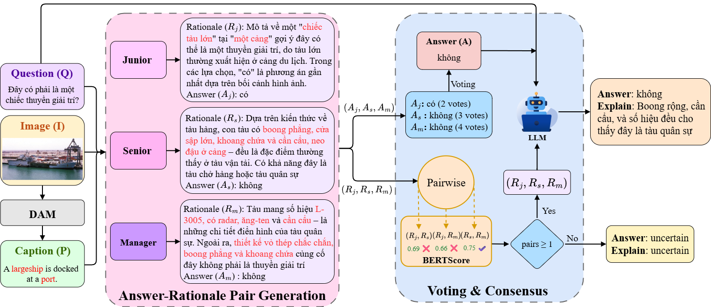

 VMARC-QA: A Knowledge-based Multi-agent Approach for Vietnamese VQA with Rationale Explanations

[](https://github.com/T-Sunm/VMARC-QA/blob/main/2026_AICI_VMARC-QA.pdf)
[](https://github.com/T-Sunm/VMARC-QA)
[](https://huggingface.co/datasets/VLAI-AIVN/ViVQA-X)
[](https://github.com/T-Sunm/VMARC-QA/blob/main/LICENSE)

---

## 📖 Introduction

This is the official implementation of the paper **"A knowledge-based multi-agent approach for Vietnamese VQA with rationale explanations"**.

Visual Question Answering with Natural Language Explanations (VQA-NLE) is a major challenge for AI, especially for the Vietnamese language due to a lack of specialized datasets and methods.

**VMARC-QA** (Vietnamese Multi-Agent Rationale-driven Consensus for Question Answering) is a framework designed to solve this problem. Our system uses a team of AI agents working in parallel to gather evidence, form a logical explanation, and ultimately derive a final answer.

The core features of VMARC-QA include:

* **Multi-Agent Collaboration**: Employs an ensemble of three distinct agents (Junior, Senior, Manager) that work in parallel to gather evidence using different tools and perspectives.
* **Verifiable Reasoning**: Implements an "evidence-to-rationale" process, ensuring that every explanation is grounded in the evidence collected by the agents, rather than being freely hallucinated.
* **Reliable Consensus**: Aggregates agent outputs through a dual-stream mechanism: weighted voting determines the best answer, while a semantic consistency check on the rationales ensures the final output is coherent and trustworthy.

On the **ViVQA-X** benchmark, VMARC-QA sets a new standard for answer accuracy while maintaining top-tier explanation quality:

* 🏆 : Achieves **64.8%** answer accuracy, outperforming strong prior models like NLX-GPT by over **11 percentage points**.
* ✍️ : Produces explanations with high semantic fidelity, confirmed by a highly competitive **BERTScore of 76.0**, nearly matching the specialized fine-tuned model NLX-GPT (76.3).

The overall architecture of VMARC-QA is shown in the figure below:


*Figure 1: Overview of the VMARC-QA Framework. Three agents independently generate answer-rationale pairs, which are then aggregated by a dual-stream consensus mechanism to produce the final output.*


## 📚 Table of Contents
- [Introduction](#-introduction)
- [Quick Start](#-quick-start)
- [Repository Structure](#-repository-structure)
- [Installation](#️-installation)
- [Data Preparation](#-data-preparation)
- [Usage](#️-usage)
- [Results](#-results)
- [Citation](#-citation)
- [License](#-license)

## 🚀 Quick Start

This guide helps you set up the necessary environments to run VMARC-QA.

```bash
# 1. Clone the repository and its submodules
git clone --recurse-submodules [https://github.com/T-Sunm/VMARC-QA.git](https://github.com/T-Sunm/VMARC-QA.git)
cd VMARC-QA

# 2. Set up the main environment (for the LangGraph framework)
conda create -n vmarc-qa python=3.10 -y
conda activate vmarc-qa
pip install -r requirements.txt

# 3. Set up the tool environment (for the ViVQA-X model)
# (Execute from the project's root directory)
cd ViVQA-X
conda create -n vmarc-qa-tool python=3.10 -y
conda activate vmarc-qa-tool
pip install -r requirements.txt
pip install fastapi uvicorn[standard] python-multipart
cd ..
```
## 📁 Repository Structure

```
VMARC-QA/
├── src/                 # Main framework source code
│   ├── agents/          # Logic for Junior, Senior, and Manager agents
│   ├── core/            # LangGraph multi-agent graph implementation
│   ├── models/          # Pydantic models for state management
│   ├── tools/           # VQA and knowledge retrieval tools
│   ├── utils/           # Utility functions
│   ├── evaluation/      # Scripts for performance evaluation
│   └── main.py          # Main entry point for the application
│
├── ViVQA-X/             # Submodule containing the base Vietnamese VQA model
│
├── scripts/             # Scripts for running experiments and setup
│
├── .env.example         # Example environment file
└── requirements.txt     # Python dependencies
```


## ⚙️ Installation

This section provides a detailed step-by-step guide to setting up the entire project.

### 1. Prerequisites
- **Conda**: For managing isolated environments.
- **Python 3.10+**
- **API Keys**: Copy the `.env.example` file to `.env` and fill in your API keys (if you plan to use services like OpenAI, Wikipedia, etc.).

### 2. Environment Setup
Follow the steps in the [🚀 Quick Start](#-quick-start) section to install the two required conda environments: `vmarc-qa` and `vmarc-qa-tool`.

## 📦 Data Preparation

VMARC-QA is evaluated on the **ViVQA-X** dataset, which uses images from MS COCO 2014.

### 1. Download COCO 2014 Images

Create a `data` directory and download the `val2014` image set:

```bash
# Create the directory structure
mkdir -p data/COCO_Images data/ViVQA-X

# Download and unzip the Validation 2014 images (~6GB)
wget http://images.cocodataset.org/zips/val2014.zip -P data/
unzip data/val2014.zip -d data/COCO_Images/
rm data/val2014.zip
```

### 2. Set Up ViVQA-X Annotations
Copy the required annotation files from the submodule into your data directory:

```bash
# Copy the annotation file from the submodule
cp ViVQA-X/data/final/ViVQA-X_test.json data/ViVQA-X/
```

### 3. Final Directory Structure
Your data directory structure should look like this when you're done:

```
Visual-Multi-Agent-Knowledge-QA-/
├── data/
│   ├── COCO_Images/
│   │   └── val2014/
│   │       ├── COCO_val2014_000000000042.jpg
│   │       └── ...
│   └── ViVQA-X/
│       └── ViVQA-X_test.json
```

## ▶️ Usage
The VMARC-QA system consists of multiple components. Follow these steps to run a full experiment.

### Step 1: Run the VQA Tool Server

Open a terminal, activate the `vmarc-qa-tool` environment, and start the API server from the **ViVQA-X** submodule directory.

```bash
conda activate vmarc-qa-tool
cd ViVQA-X/api
python main.py
```

This server provides the **Aligned Candidate Generator** tool to the agents.

### Step 2: Run the LLM Server (Optional, for local models)

If you are using a local LLM with VLLM, open a new terminal, activate the `vmarc-qa` environment, and start the server. The following is an example for the **Qwen** model:

```bash
conda activate vmarc-qa

# Command to serve a local LLM with VLLM
vllm serve Qwen/Qwen2-1.5B \
    --port 1234 \
    --dtype auto \
    --gpu-memory-utilization 0.5 \
    --max-model-len 4096 \
    --trust-remote-code
```

### Step 3: Run the Main Experiment

Once the servers are ready, open another new terminal, activate the `vmarc-qa` environment, and run the main experiment script.

**Configuration:** Open the `scripts/full_system.sh` file to customize your run:

* **SAMPLES**: Set the number of samples to run. Set to `0` to run on the entire test set.
* **TEST\_JSON\_PATH** and **TEST\_IMAGE\_DIR**: By default, the script looks for data in the `data/` directory. You can uncomment and modify these paths if your data is stored elsewhere.

**Execution:**

```bash
conda activate vmarc-qa
bash scripts/full_system.sh
```


## 📈 Main Results

Performance comparison on the ViVQA-X test set. Our method establishes a new state-of-the-art in answer accuracy while maintaining highly competitive explanation quality.

<div align="center">

| Method              | B1   | B2   | B3   | B4   | M    | R-L  | C    | S   | BS   | Acc  |
|:--------------------|:----:|:----:|:----:|:----:|:----:|:----:|:----:|:---:|:----:|:----:|
| Heuristic Baseline [5]  | 8.46 | 3.0  | 1.3  | 0.6  | 8.5  | 7.9  | 0.5  | 0.6 | 70.8 | 10.1 |
| LSTM-Generative [5] | 22.6 | 11.7 | 6.2  | 3.2  | 16.4 | 23.7 | 34.1 | 4.3 | 72.2 | 53.8 |
| **NLX-GPT** [21]        | **42.4** | **27.8** | **18.5** | **12.4** | 20.4 | **32.8** | **51.4** | **5.0** | **76.3** | 53.7 |
| OFA-X [17]              | 30.1 | 22.5 | 10.9 | 9.2  | 17.6 | 25.4 | 25.7 | 3.9 | 68.9 | 50.5 |
| ReRe [14]               | 34.0 | 21.2 | 13.8 | 9.0  | **20.8** | 29.4 | 35.5 | 4.2 | 74.9 | 47.5 |
| **VMARC-QA (ours)** | 27.5 | 14.8 | 8.1  | 4.4  | 17.6 | 22.4 | 23.6 | 4.0 | 76.0 | **64.8** |

</div>


## 📜 Citation

If you use the code or methods from this work in your research, please cite our paper:

```
```


## 📝 License

This project is licensed under the MIT License. See the [LICENSE](LICENSE) file for details. 

